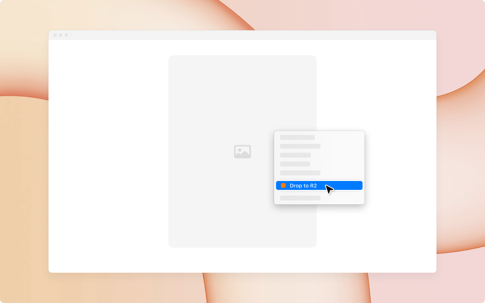

# D2R2

Drop images to Cloudflare R2

A Chrome extension for uploading images from web pages to a Cloudflare R2 bucket via right-click

## Installation

1. Clone this repository
2. `cd` into the project directory
3. Run `pnpm install` to install dependencies
4. Run `pnpm dev` to run in development mode
5. Run `pnpm build` to build for production
6. After building the extension, open Chrome browser and visit `chrome://extensions`
7. Enable "Developer mode" in the top right corner
8. Click "Load unpacked extension" and select the `.output/chrome-mv3` folder in the project directory

## Cloudflare Worker Deployment

This extension requires a Cloudflare Worker to function. Here are the complete deployment steps:

You can find the Worker code example in [worker_sample.js](./worker_sample.js).

## Implementation Details

This extension uses the **Worker-bound R2 bucket** pattern:

- Worker is bound to a fixed R2 bucket, managing all actual operations
- Extension frontend only needs to configure Cloudflare ID and Worker URL
- Optional folder path configuration for storing in different paths within the bucket

### 1. Create R2 Bucket

1. Log in to [Cloudflare Dashboard](https://dash.cloudflare.com/)
2. Select "R2" from the sidebar
3. Click "Create bucket" and enter a bucket name
4. Note down the bucket name for later configuration in the extension and Worker

### 2. Create R2 Access Keys

1. On the R2 page, click "Manage R2 API Tokens"
2. Click "Create API Token"
3. Select "Admin Read & Write" permissions
4. After creation, note down the `Access Key ID` and `Secret Access Key`
5. **Note: This is your only chance to see the Secret Key, please save it securely**

### 3. Create and Configure Worker

1. Select "Workers & Pages" from the Cloudflare Dashboard sidebar
2. Click "Create application" and select "Worker"
3. Name your Worker and click "Create Worker"
4. After deployment, click the Worker name to enter details page
5. Click the "Settings" tab, then:

   a. **Bind R2 Bucket**:

   - In the "Variables" section, click "R2 Bucket Bindings"
   - Click "Add binding"
   - Enter `BUCKET_NAME` as the variable name (must match the name used in Worker code)
   - Select the previously created R2 bucket
   - Click "Save"

   b. **Configure Environment Variables**:

   - In the "Variables" section, click "Environment Variables"
   - Add the following environment variables:
     - `R2_ACCESS_KEY_ID`: Enter the previously saved Access Key ID
     - `R2_SECRET_ACCESS_KEY`: Enter the previously saved Secret Access Key
     - `ALLOWED_CLOUDFLARE_ID`: Enter your Cloudflare Account ID (32-character hex string)
       - This is a critical security measure that ensures only your account ID is authorized
       - You can find your Account ID in the Cloudflare Dashboard URL or in the right sidebar
   - Click "Save"

6. Click "Quick edit" button and paste the Worker code provided in this project
7. Update the `ALLOWED_ORIGINS` array in `wxt.config.ts` with your extension ID (optional)

8. Click "Save and deploy"

### 4. Worker Code Security Considerations

1. **Never** store R2 access keys in frontend code
2. Ensure `ALLOWED_ORIGINS` restricts access to only your extension
3. **Always** configure the `ALLOWED_CLOUDFLARE_ID` environment variable as an authorization requirement
   - This ensures only requests with your specific Cloudflare Account ID are processed
   - Prevents unauthorized use even if someone discovers your Worker URL
4. Consider adding additional authentication mechanisms, such as custom tokens
5. Regularly rotate R2 access keys

### 5. Worker Configuration in Extension

1. Install and open the extension
2. In the popup configuration page:
   - Enter your Cloudflare Account ID
   - Enter Worker URL, format: `https://your-worker-name.your-username.workers.dev`
   - Storage Path Configuration:
     - If left empty: Images will be uploaded to the root directory of your R2 bucket
     - If filled: A secondary menu will appear allowing you to choose between:
       - Root directory: Upload directly to bucket root
       - Custom folder: Upload to the specified folder path
3. Save configuration

## License

MIT
