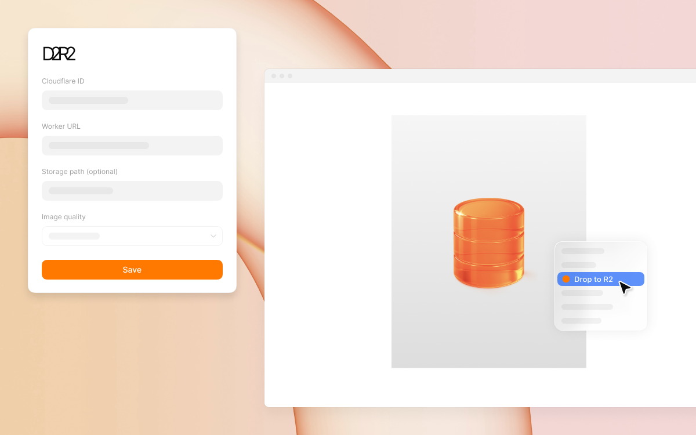

# D2R2

Drop images to Cloudflare R2

A Chrome extension for uploading images from web pages to Cloudflare R2 via right-click menu

## Installation

1. Clone this repository
2. Install [Vite+](https://viteplus.dev/guide/), then run `vp install`. Vite+ manages the Node.js and pnpm versions declared in `package.json` under `devEngines`.
3. Run `vp run build`
4. Open Chrome and visit `chrome://extensions`
5. Enable "Developer mode"
6. Click "Load unpacked" and select the `.output/chrome-mv3` folder

## Development

WXT manages extension entrypoints, the manifest, React integration, and browser-specific builds in `wxt.config.ts`. Vite+ supplies the Vite engine and the lint, format, and test configuration in `vite.config.ts`.

Use `vp run` to execute the WXT scripts. The built-in `vp dev` and `vp build` commands run Vite directly and do not build this extension.

| Command                | Purpose                                       |
| ---------------------- | --------------------------------------------- |
| `vp run dev`           | Start Chrome extension development            |
| `vp run dev:firefox`   | Start Firefox extension development           |
| `vp run check`         | Check formatting, lint, and TypeScript types  |
| `vp run typecheck`     | Run TypeScript checks only                    |
| `vp run test`          | Run all unit tests once                       |
| `vp fmt`               | Format the project                            |
| `vp run build`         | Build Chrome MV3 into `.output/chrome-mv3/`   |
| `vp run build:firefox` | Build Firefox MV2 into `.output/firefox-mv2/` |
| `vp run zip`           | Build and package the Chrome extension        |
| `vp run zip:firefox`   | Build and package the Firefox extension       |

`vp run check` combines Vite+'s format/lint checks with `tsc --noEmit`, preserving the existing lint rules and WXT-generated TypeScript configuration. Run `vp install` before checking a fresh checkout so `wxt prepare` generates `.wxt/`.

Tests import from `vite-plus/test`. The workspace pins Vitest to the version bundled with Vite+ so the test runner and mocks share a single copy; keep that pin aligned when upgrading Vite+.

## Worker Setup

This extension requires a Cloudflare Worker. See [worker_sample.js](./worker_sample.js) for the code.

### 1. Create R2 Bucket

1. Log in to [Cloudflare Dashboard](https://dash.cloudflare.com/)
2. Go to "R2" → "Create bucket"
3. Note down the bucket name

### 2. Create Worker

1. Go to "Workers & Pages" → "Create application" → "Create Worker"
2. Name your Worker and deploy
3. In Worker Settings → Variables:

   **R2 Bucket Binding:**
   - Variable name: `BUCKET_NAME`
   - Select your R2 bucket

   **Environment Variables:**
   - `ALLOWED_CLOUDFLARE_ID`: Your Cloudflare Account ID (32-char hex, found in dashboard URL)
   - `R2_PUBLIC_DOMAIN`: Your R2 public domain (e.g., `pub-xxx.r2.dev`)

4. Go to Worker → "Quick edit" → paste the worker code → "Save and deploy"

\*The sample Worker controls the final R2 object name, by default it keeps the uploaded filename and appends a suffix when needed to avoid overwrites.

### 3. Extension Configuration

1. Open the extension popup
2. Enter your Cloudflare Account ID
3. Enter Worker URL: `https://your-worker.your-username.workers.dev`
4. (Optional) Add folder paths for organized uploads
5. (Optional) Set image quality to compress images

## Security

- The Worker validates requests using your Cloudflare Account ID
- Never expose your Worker URL publicly if possible
- Uses R2 Binding (no API keys needed)

## License

MIT
