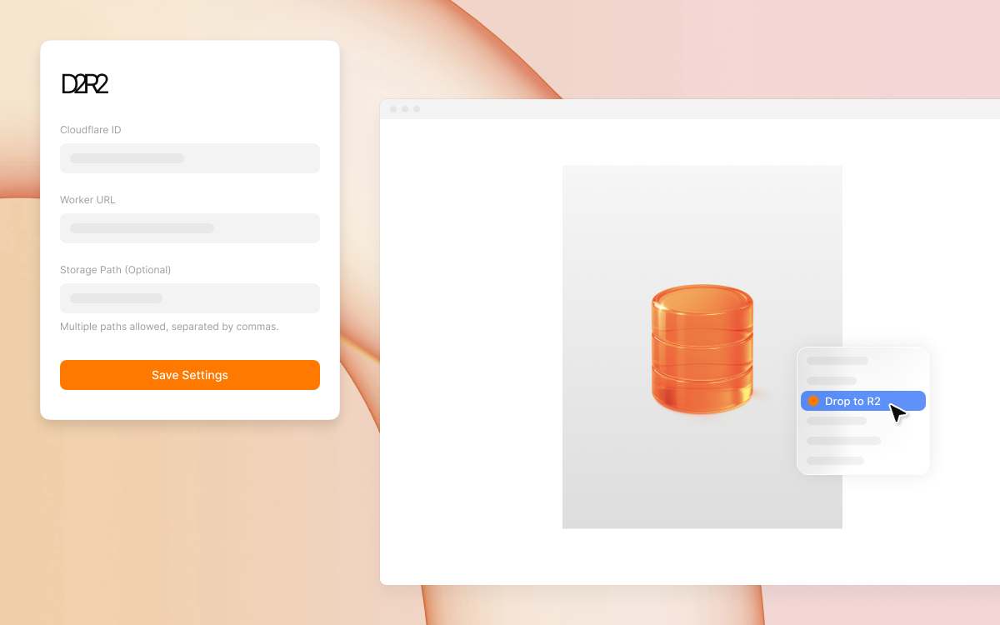

<div align="center">
  
</div>
&nbsp;

# D2R2 - Drop images to Cloudflare R2

A Chrome extension for uploading images from web pages to Cloudflare R2 buckets via right-click.

## Installation

1. Clone this repository
2. `cd` into the project directory
3. Run `pnpm install` to install dependencies
4. Run `pnpm dev` to run in development mode
5. Run `pnpm build` to build for production

## Chrome Extension Loading Instructions

1. After building the extension, open Chrome browser and visit `chrome://extensions`
2. Enable "Developer mode" in the top right corner
3. Click "Load unpacked extension" and select the `.output/chrome-mv3` folder in the project directory

## Cloudflare Worker Deployment

This extension requires a Cloudflare Worker to function. Here are the complete deployment steps:

> You can find the Worker code example in [worker_sample.js](./worker_sample.js).

## Implementation Details

This extension uses the **Worker-bound R2 bucket** pattern:

- Worker is bound to a fixed R2 bucket, managing all actual operations
- Extension frontend only needs to configure Cloudflare ID and Worker URL
- Optional folder path configuration for storing in different paths within the bucket

### 1. Create R2 Bucket

1. Log in to [Cloudflare Dashboard](https://dash.cloudflare.com/)
2. Select "R2" from the sidebar
3. Click "Create bucket" and enter a bucket name
4. Note down the bucket name for later configuration in the extension and Worker

### 2. Create R2 Access Keys

1. On the R2 page, click "Manage R2 API Tokens"
2. Click "Create API Token"
3. Select "Admin Read & Write" permissions
4. After creation, note down the `Access Key ID` and `Secret Access Key`
5. **Note: This is your only chance to see the Secret Key, please save it securely**

### 3. Create and Configure Worker

#### Method 1: Using Cloudflare Dashboard

1. Select "Workers & Pages" from the Cloudflare Dashboard sidebar
2. Click "Create application" and select "Worker"
3. Name your Worker and click "Create Worker"
4. After deployment, click the Worker name to enter details page
5. Click the "Settings" tab, then:

   a. **Bind R2 Bucket**:

   - In the "Variables" section, click "R2 Bucket Bindings"
   - Click "Add binding"
   - Enter `BUCKET_NAME` as the variable name (must match the name used in Worker code)
   - Select the previously created R2 bucket
   - Click "Save"

   b. **Configure Environment Variables**:

   - In the "Variables" section, click "Environment Variables"
   - Add two environment variables:
     - `R2_ACCESS_KEY_ID`: Enter the previously saved Access Key ID
     - `R2_SECRET_ACCESS_KEY`: Enter the previously saved Secret Access Key
   - Click "Save"

6. Click "Quick edit" button and paste the Worker code provided in this project
7. Update the `ALLOWED_ORIGINS` array in `wxt.config.ts` with your extension ID (optional)
8. Click "Save and deploy"

#### Method 2: Using Wrangler CLI

1. Install Wrangler CLI: `npm install -g wrangler`
2. Log in to Cloudflare account: `wrangler login`
3. Create Worker project:

   ```bash
   mkdir d2r2-worker && cd d2r2-worker
   wrangler init
   ```

4. Create and configure `wrangler.toml`:

   ```toml
   name = "d2r2-worker"
   main = "src/index.js"
   compatibility_date = "2025-04-0"

   # R2 bucket binding
   [[r2_buckets]]
   binding = "BUCKET_NAME" # Must match the name in Worker code
   bucket_name = "your-bucket-name" # Your R2 bucket name

   # Environment variables (sensitive info, use wrangler secret instead of writing here)
   [vars]
   # You can set non-sensitive environment variables here
   ```

5. Save the Worker code provided in this project to `src/index.js`
6. Update the `ALLOWED_ORIGINS` array in the code with your extension ID
7. Add secrets (do not add these to the config file):

   ```bash
   wrangler secret put R2_ACCESS_KEY_ID
   # Enter your Access Key ID when prompted

   wrangler secret put R2_SECRET_ACCESS_KEY
   # Enter your Secret Access Key when prompted
   ```

8. Publish Worker:

   ```bash
   wrangler publish
   ```

9. Wrangler will output your Worker URL, note it down for later configuration in the extension

### 4. Worker Code Security Considerations

1. **Never** store R2 access keys in frontend code
2. Ensure `ALLOWED_ORIGINS` restricts access to only your extension
3. Consider adding additional authentication mechanisms, such as custom tokens
4. Regularly rotate R2 access keys

### 5. Example Worker Code

Worker code example can be found in [worker_sample.js](./worker_sample.js). Copy it to your Worker and modify according to your needs.

### 6. Worker Configuration in Extension

1. Install and open the extension
2. In the popup configuration page:
   - Enter your Cloudflare Account ID
     - Log in to Cloudflare Dashboard
     - Your account ID can be found in the bottom right corner on the Overview page
   - Enter Worker URL, format: `https://your-worker-name.your-username.workers.dev`
   - Storage Path Configuration:
     - If left empty: Images will be uploaded to the root directory of your R2 bucket
     - If filled: A secondary menu will appear allowing you to choose between:
       - Root directory: Upload directly to bucket root
       - Custom folder: Upload to the specified folder path
3. Save configuration

## Troubleshooting

- **Invalid or unexpected token**: Check if environment variables are correctly configured, ensure using `env.variable_name` format
- **Unauthorized (403)**: Confirm extension ID is correctly added to `ALLOWED_ORIGINS` array
- **Failed to fetch image**: Check if image URL is accessible, some websites may restrict cross-origin requests
- **Service bind failed**: Ensure R2 bucket binding name is `BUCKET_NAME`, must match Worker code
- **URL build error**: Need to correctly configure `BUCKET_NAME_META` environment variable or access actual bucket name

## License

MIT
